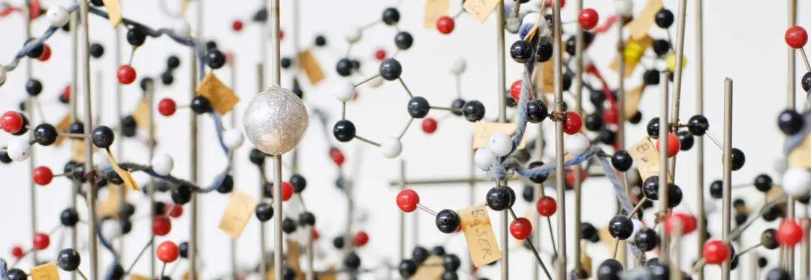

<!-- ---
hide:
  - navigation
--- -->

# Empowering a Global Crystallography Community
**QCrBox** (Quantum Crystallographic Toolbox) is a collaborative project transforming small-molecule crystallographic analysis. With a large and growing community of crystallographers and chemists, QCrBox provides the tools needed to make crystallography more accessible, reliable, and innovative for everyone

{ align=left; }

## Key Principles of QCrBox:

### Interoperability
QCrBox integrates widely used crystallographic software into a single, secure workflow. This allows researchers at all levels to access state-of-the-art tools for data integration, structure refinement, and cutting-edge quantum crystallography techniques.

### Beyond the Independent Atom Model (IAM)
QCrBox enables routine access to quantum crystallography methods, going beyond traditional Independent Atom Models (IAM). Modern diffraction data contains extensive information, and QCrBox unlocks this potential for a much wider audience, making advanced crystal structure analysis available to the broader scientific community.

### Resilience
Ensuring the longevity of crystallographic research is at the core of QCrBox. By preserving software and data through version histories, QCrBox guarantees that research outputs and (legacy) software remain accessible and reproducible, benefiting future scientists.

### Reusabiltiy
The project continually expands its integral Quantum Crystallographic Toolbox (qctbx), offering reusable functions to the community. These tools can be integrated with existing software or used to develop new crystallographic applications, fostering innovation and collaboration across the field.

# A Project with Global Support
QCrBox has the full backing of major crystallographic institutions, including European and IUCr commissions on quantum crystallography, which recognise its potential to advance the field significantly. These official bodies, representing thousands of crystallography users worldwide, strongly advocate QCrBox’s mission.

# Supporting a Large and Diverse User Community
QCrBox serves a broad international community of crystallographers, scientists, and software developers. Whether you're a seasoned researcher or new to the field, QCrBox provides tools that make it easier for everyone to participate in advanced crystallographic analysis.

- **Widespread Benefit**: QCrBox's streamlined workflows, advanced methods, and reproducibility will benefit the growing user base.

- **Collaborative Environment**: Researchers and developers are invited to contribute their own tools and software, with support from professional research software engineers who ensure sustainable integration.

# About the Project

- **Funding**: QCrBox is a three-year project (September 2022 – September 2025) funded by public institutions.
- **Leadership**: The project is led by the University of Southampton and Durham University, with strong institutional support from the crystallographic community.
- **Open Source & Free to Use**: QCrBox is open to all, inviting contributions from across the global crystallography community to ensure that the project grows and adapts to its users' needs.

_The documentation structure is based on the [Divio Documentation System](https://documentation.divio.com/)._

