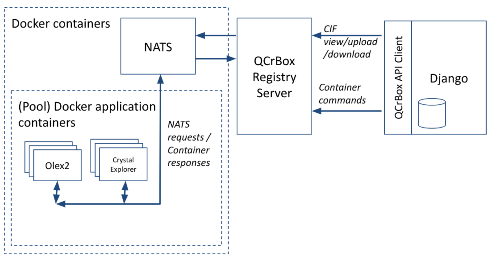

# Architecture

## Guiding Principles

- Keep system as loosely coupled as possible, to reduce maintenance overhead observed in previous versions of the software
- Assume a closed single system for server deployment (at least for now), to simplify inter-component communication, deployment, and reduce attack surfaces

## Architectural Layout & Key Components

Key components:

- **Django front-end website:** entry point for end-users, allows researchers to upload and manage input and output CIF data files, initiate and manage workflow runs, and administrate users and user groups
- **QCrBox API Client:** Python-based API used by the Django website to drive the QCrBox system via the QCrBox Registry Server. API functions include upload/download of CIF data files, and the running and management of QCrBox container commands throughout a command lifecycle
- **QCrBox Registry Server:** coordinates data management of CIF and other files to/from the NATS object store, and via the QCrBox client API, accepts command requests and assigns them to idle application containers and responds to command status requests (similar to a cluster job scheduler). Internally uses an SQLite database to store persistent container status information
- **[NATS](http://docs.nats.io/) data object store:** a secure and high performance open source data layer, incorporating queue-based guaranteed messaging and NoSQL key/value object storage
- **Pool of Docker application containers:** crystallography applications and support services hosted separately within Docker containers. Each container functions as a computational resource for a single application, accepting command requests from the QCrBox Registry Service, ingesting input data from NATS, running the application against that input, and marshalling resultant output to NATS (stored as 'calculations')

## Limitations

### Application service registrations are not persistent across registry restarts

If the QCrBox registry service fails or restarts, the application service containers must also be restarted to be
re-registered with the registry. The registry stores application state in an in-memory database that is lost when the
registry restarts. If the registry container restarts and there are no applications registered, the simplest solution is
to restart everything with `qcb up --all`, or with the specific applications you need.

Be aware that each call to `qcb up` restarts the registry before starting the requested services. For example, if you
run `qcb up olex2` and then `qcb up crystal-explorer`, only Crystal Explorer will be registered. Olex2 will remain
running, but because the registry was restarted in the second command, its registration will have been lost.
