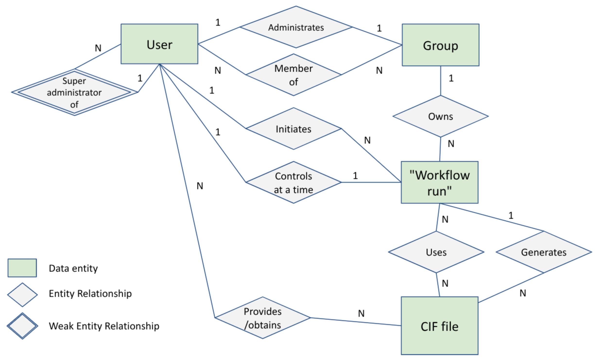

# Front-end Django Data Model

## Key Data Entities

The Django front-end consists of four key entities:

- A User of the system
- A Group (such as a research group) which contains many users
- A CIF file (Crystallographic Information File), a standardised text file format for representing crystallographica information defined by the International Union of Crystallography
- A Workflow Run, which is a logical grouping of previously run application steps and generated CIF files into a coherent view of them, with applications connected by CIF files as either input or output

## Data Entity Relationships

Key data relationships:

A User...

- may be a Super Administrator, able to manage all aspects of users
- may be a member of many Groups
- may administrate a Group
- may initiate many Workflow Runs
- must control only one active Workflow Run at any time
- may provide or obtain many CIF files from/to the system

A Group...

- may have many Users as members
- may own many Workflow Runs

A Workflow Run...

- uses many CIF files
- generates many CIF files
