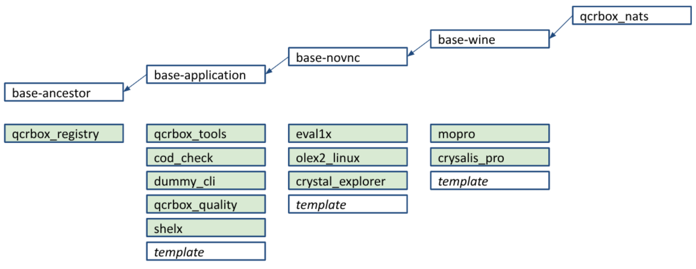

# Docker Container Applications

## Docker Container Lifecycle

From when it is started, a Docker application container progresses through the following lifecycle steps in a continuous loop:

- **Idle:** an implied step where the container waits for a command request to execute
- `Prepare`: the application container obtains an input CIF file and prepares its environment to run the application as it requires
- `Run`: the container runs the hosted application using the provided CIF files, and generates an output CIF file
- `Finalise`: the container cleans up following the application run step and uploads the generated CIF file to NATS

## Docker Container Hierarchy

Docker application and services are defined separately, and fall into several "classes" of Docker containers.
Each class "inherits" the Docker features and configuration of a parent "class", to avoid duplication of container definitions.

There are four key classes:

- `base-ancestor`: based on a micromamba Docker image, contains core development, network, Quantum Crystallography Toolbox (cctbx) and other tools. Constructs a Python virtual environment for QCrBox and installs the Python qcrboxtools package into it.
- `base-application`: a generic application layer that inherits from `base-ancestor`, that activates the qcrboxtools virtual environment, runs a qcrboxtools configure script to set up a database for it, and runs the application.
- `base-novnc`: inherits from `base_application`, installs novnc (a VNC server) and dependencies and runs it
- `base-wine`: inherits from `base_novnc`, installs the Wine Windows emulator, along with Gecko, a browser for Wine, and Mono, a .NET replacement

`qcrbox-nats` is a standalone service providing the inter-service communication messaging using NATS, and is not defined to inherit features from any of the above.

Other infrastructural and application services inherit from one of these base services, depending on their needs.
In particular, the core infrastructure services:

- `qcrbox_registry` - hosts, initialises, and maintains a database for registered services and their interfaces, as well as hosting a database for application container "calculations" which can be fed into other application containers. Also currently contains a prototype end-user web interface to execute a predefined workflow
- `qcrboxtools` - a common tools service, essentially convenience functions for use within a workflow, e.g. CIF file manipulation

## Docker Service Definitions

Services are defined below the `services/` directory, within three subdirectories depending on their level of abstraction indicated in the service hierarchy, i.e. `core/`, `base_images/` and `applications/`.
At a minimum, such as with the qcrbox_nats service, a service has a Dockerfile.

At the core and base_image level, services tend to be managed by supervisord.
`qcrbox_registry_service.conf` and possibly `supervisord.conf` are defined for the service for supervisord to manage within the container (if any).

Application-level services also have some/all of the following common components defined in these directories:

- `docker-compose.*.build.yml` & `docker-compose.*.run.yml`: define build/run aspects
- `config_*.yaml`: importantly, defines the QCrBox service interface for a particular application, listing the operations the service presents for use within a workflow. Operations are defined as a sequence of `prepare`, `run`, and `finalise` tasks, each executed in this order. Each task can be defined as either cli_command, python_callable, interactive, or interactive_session, and each task 
- `configure_*.py`: defines Python functions run by the container during a container's prepare-run-finalise lifecycle and referred to in a container's `config_*.yaml`
